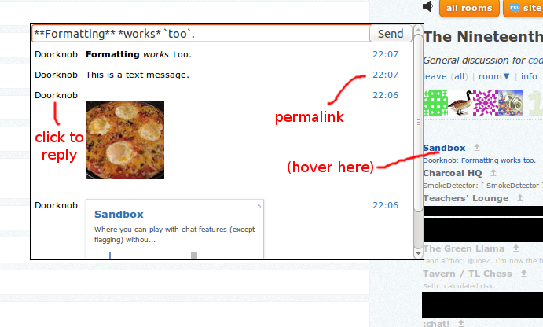

# stackexchange-chatception

A tiny widget that allows you to quickly chat in different Stack Exchange chatrooms from a single page.

- Hover over any of the chatrooms shown on the right side of the page to pop up the small widget.

- It will show a history of the last few messages from that chatroom (with full formatting, including oneboxes), the user who sent them, and a timestamp.

- Type in the text field at the top to quickly send a message to that chatroom.

- Click the username of any message shown in the widget to reply to that message.

- The timestamp of any message shown also acts as a permalink.

